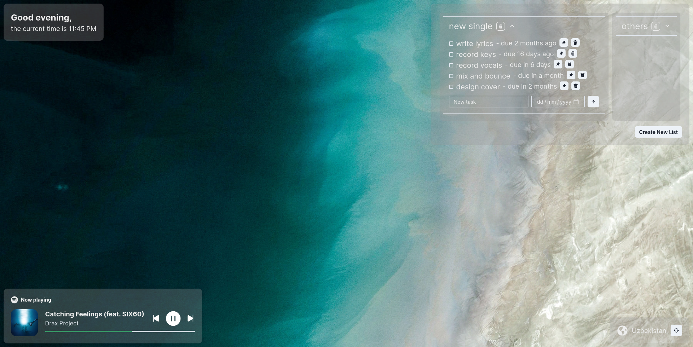

# ZenTab

A minimalist new tab extension for your browser / webpage tuned for your focus. 

## Features

### Personalized Backgrounds

- Inspired by Earth View from Google Earth, Zentab displays the same random satellite images from Google Earth as the background.
- Alongside the location of the current background on the bottom left, you can switch to another random background image.

### To-do Lists Task Management

- Users can create multiple to-do lists, allowing for better organization of tasks.
- Each list supports the addition, editing, and deletion of tasks.
- Tasks can be marked as complete, providing a sense of accomplishment.
- Due dates can be set for tasks, with the app displaying the time remaining or time since the due date.

### Auto Task Sorting and Pinning

- New and edited tasks are sorted within the list, with the earliest due date tasks displayed first.
- Users can manually pin tasks to prioritize them, displaying pinned tasks at the top of the list.

### Spotify Integration

- Zentab allows users to connect their Spotify account.
- Users can view and control their currently playing songs directly within the app.
- Enjoy seamless playback control without leaving the Zentab interface.

### Data Persistence

- All to-do lists and task details are saved automatically.
- Users can pick up where they left off, with lists, tasks and the Spotify player reloading upon reopening the app.

## Getting Started

### Install the Extension or Website Link

### Alternatively - Clone and Run Locally

## Technologies Used

- React.js
- Chakra UI
- Google Earth API
- Moment.js
- Spotify Web API / Web Playback SDK

## Contributing

Contributions are welcome! If you have suggestions, feature requests, or bug reports, please open an issue or submit a pull request.

## License
